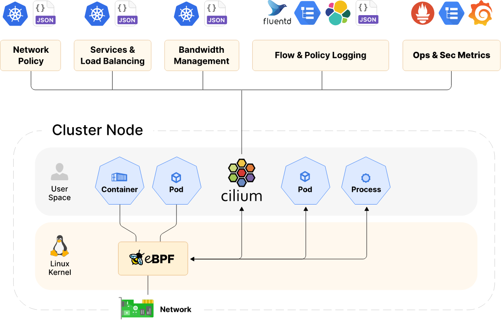

# Runtime

**Resources:**

> - https://thenewstack.io/the-cloud-native-landscape-the-runtime-layer-explained/
> - https://landscape.cncf.io/guide#runtime--cloud-native-storage
> - https://landscape.cncf.io/guide#runtime--container-runtime
> - https://landscape.cncf.io/guide#runtime--cloud-native-network

***LEGAL NOTICE: This document is created for educational purposes, and it can not be used for any commercial intentions. If you find this document useful in any means please support the original authors for ethical reasons.***

---

## Cloud Native Storage

### Rook (CNF Graduated)

### CubeFS (CNF Incubating)

### Longhorn (CNF Incubating)

---

## Container Runtime

### Containerd (CNF Graduated)

### CRI-O (CNF Incubating)

---

## Cloud Native Networking

### Cilium (CNF Incubating)

[Homepage](https://cilium.io/)

#### **eBPF-based Networking, Observability, Security**

Cilium is an open source software for providing, securing and observing network connectivity between container workloads - cloud native, and fueled by the revolutionary Kernel technology eBPF.

#### **What is Cilium?**

Cilium is an open source project to provide networking, security, and observability for cloud native environments such as Kubernetes clusters and other container orchestration platforms.

At the foundation of Cilium is a new Linux kernel technology called eBPF, which enables the dynamic insertion of powerful security, visibility, and networking control logic into the Linux kernel. eBPF is used to provide high-performance networking, multi-cluster and multi-cloud capabilities, advanced load balancing, transparent encryption, extensive network security capabilities, transparent observability, and much more.

#### **Networking**

- **Service Load Balancing**

    Kubernetes doesn't come with an implementation of Load Balancing. This is usually left as an exercise for your cloud provider or in private cloud environments an exercise for your networking team. Cilium can attract this traffic with BGP and accelerate leveraging XDP and eBPF. Together these technologies provide a very robust and secure implementation of Load Balancing.

    Cilium and eBPF operate at the kernel layer. With this level of context we can make intelligent decisions about how to connect different workloads whether on the same node or between clusters. With eBPF and XDP Cilium enables significant improvements in latency and performance and eliminates the need for kube-proxy entirely.

- **Scalable Kubernetes CNI**

    Cilium’s control and data plane has been built from the ground up for large-scale and highly dynamic cloud native environments where 100s and even 1000s of containers are created and destroyed within seconds. Cilium’s control plane is highly optimized, running in Kubernetes clusters of up to 5K nodes and 100K pods. Cilium’s data plane uses eBPF for efficient load-balancing and incremental updates, avoiding the pitfalls of large iptables rulesets. Cilium is fully IPv6-aware.

- **Multi-cluster Connectivity**

    With standard Kubernetes networking each cluster is an island, requiring proxies to connect workloads across clusters for the purposes of migration, disaster-recovery, or geographic locality. Cilium Cluster Mesh creates a single zone of connectivity for load-balancing, observability and security between nodes across multiple clusters, enabling simple, high-performance cross-cluster connectivity.

#### **Observability**

- **Identity-aware Visibility**

    Modern distributed systems require rich context to enable observability. However, the highly dynamic nature of Kubernetes reduces the value of traditional visibility tools. Because Cilium leverages eBPF for a native understanding of Kubernetes label identity (for pods) and DNS-aware identity (for external workloads), and rich context at the system call and application layer. Cilium provides the right level of information to troubleshoot application and connectivity issues. Cilium’s Hubble framework exposes this via API, CLI, and a graphical UI.

- **Advanced Self Service Observability**

    When troubleshooting connectivity between applications in an environment like Kubernetes. Tradional tools limit their inspection to the IP and TCP layers. Cilium uses eBPF to accelerate getting data in and out of L7 proxies such as Envoy, while gathering process context at the kernel layer. Enabling efficient visibility into applications and protocols like HTTP, gRPC, and Kafka. This data is available via Cilium’s Hubble flow UI, CLI, a service map UI, and Prometheus-compatible flow metrics. TLS-interception enables visibility into HTTPS traffic.

- **Network Metrics + Policy Troubleshooting**

    Building on rich identity, Cilium provides Prometheus compatible metrics for L3/L4 and L7 network flow data and exposes context like which application in a pod made these connections. This enables teams to detect and investigate network and application behavior and faults. Both flow and metrics data include rich information about what traffic has been allowed or denied by network policies, simplifying policy troubleshooting.

#### **Security**

- **Transparent Encryption**

    Securing data in flight is an increasingly important requirement in security sensitive environments. Cilium’s transparent encryption capabilities use the highly efficient IPsec capabilities built into the Linux kernel to automatically encrypt communications between all workloads within, or between, Kubernetes clusters. This mechanism is simple: it requires only a single configuration setting in Cilium and no application changes. It is also efficient, with no side-car or other application layer proxying required.

- **Security Forensics + Audit**

    IPs and ports are nearly meaningless for network security forensics and audit, given that identity in a Kubernetes cluster is highly dynamic. The identity-aware network flow logs and process context from Cilium’s Hubble can be stored to enable long-term forensics of network connectivity to identify attacks and subsequent lateral movement. Cilium’s rich context awareness, optionally combined with TLS-termination enables security visibility even over secure https connections.

- **Advanced Network Policy**

    Cilium implements basic Kubernetes Network Policy (e.g. Label + CIDR matching) but also uses its identity-aware and application aware visibility to enable both DNS-aware policies (e.g. allow to *.google.com) and application aware policies (e.g. allow HTTP GET /foo). Cilium also supports cluster-wide network policy, and host-layer firewalling. Get started here or watch a video to learn more.

#### **Architecture**

Cilium consists of an agent running on all cluster nodes and servers in your environment. It provides networking, security, and observability to the workloads running on that node. Workloads can be containerized or running natively on the system.

### CNI (CNF Incubating)