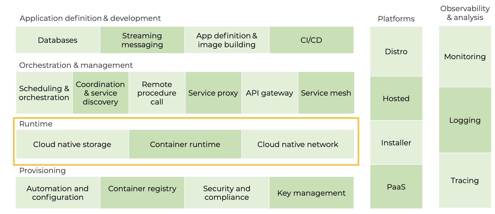
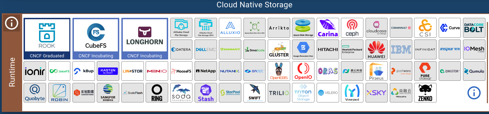
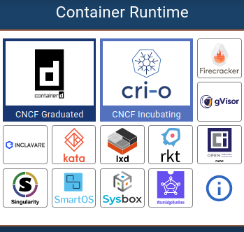

# Runtime

**Resources:**

> - https://thenewstack.io/the-cloud-native-landscape-the-runtime-layer-explained/
> - https://landscape.cncf.io/guide#runtime--cloud-native-storage
> - https://landscape.cncf.io/guide#runtime--container-runtime
> - https://landscape.cncf.io/guide#runtime--cloud-native-network

***LEGAL NOTICE: This document is created for educational purposes, and it can not be used for any commercial intentions. If you find this document useful in any means please support the original authors for ethical reasons.***

---

The runtime layer encompassing everything a container needs in order to run in a cloud native environment. That means the code used to start a container, referred to as the **runtime** engine; the tools to make persistent **storage** available to containers; and those that manage the container environment **networks**.

<h4 align="center">CNCF Cloud Native Interactive Landscape Layers</h4>

But note, these resources shouldn’t be confused with the networking and storage work handled by the infrastructure and provisioning layer concerned with getting the container platform running. Tools in this category are used by the containers directly to **start/stop**, **store data**, and **talk to each other**.

## Cloud Native Storage

### What It Is

Storage is where the persistent data of an app is stored, often referred to as persistent volume. Easy access to it is critical for the app to function reliably. Generally, when we say persistent data we mean storing things like databases, messages, or any other information we want to ensure **does not disappear** when an app gets restarted.

### Problem It Addresses

Cloud native architectures are fluid, flexible, and elastic, making persisting data between restarts challenging. To scale up and down or self-heal, containerized apps are continuously created and deleted, changing physical location over time. Therefore, cloud native storage must be provided in a **node-independent** fashion. To store data, however, you’ll need hardware — a disk to be specific — and disks, just like any other hardware, are infrastructure-bound. That’s the first big challenge.

Then there is the actual storage interface which can change significantly between datacenters (in the old world, each infrastructure had their own storage solution with its own interface), making portability really tough.

Lastly, to benefit from the elasticity of the cloud, storage must be provisioned in an automated fashion as manual provisioning and autoscaling aren’t compatible.

Cloud native storage is tailored to this new cloud native reality.

### How It Helps

The tools in this category help either

- a) provide cloud native storage options for containers,
- b) standardize the interfaces between containers and storage providers,
- c) provide data protection through backup and restore operations

The former means storage that uses a cloud native compatible container storage interface (aka tools in the second category) and which can be provisioned automatically, enabling autoscaling and self-healing by eliminating the human bottleneck.

### Technical 101

Cloud native storage is largely made possible by the Container Storage Interface (CSI) which allows a standard API for providing file and block storage to containers. There are a number of tools in this space, both open source and vendor-provided that leverage the CSI to provide on-demand storage to containers. In addition to that extremely important functionality, we have a number of other tools and technologies which aim to solve storage problems in the cloud native space. **Minio** is a popular project that, among other things, provides an S3-compatible API for object storage. Tools like **Velero** help simplify the process of backing up and restoring both the Kubernetes clusters themselves as well as persistent data used by the applications.

#### Buzzwords

- CSI
- Storage API
- Backup and Restore

#### Popular Projects/Products

- Minio
- CSI
- Ceph + Rook
- Velero

<h4 align="center">Snapshot of Cloud Native Storage Tools</h4>

## Container Runtime

### What It Is

As discussed in the provisioning layer article, a container is a set of compute constraints used to execute (that’s tech-speak for launch) an application. Containerized apps believe they are running on their own dedicated computer and are oblivious that they are sharing resources with other processes (similar to virtual machines).

The container runtime is the software that executes containerized (or “constrained”) applications. Without the runtime, you only have the container image, the file specifying how the containerized app should look like. The runtime will start an app within a container and provide it with the needed resources.

### Problem It Addresses

Container images (the files with the application specs) must be launched in a standardized, **secure** and **isolated** way. Standardized because you need standard operating rules no matter where they are running.

- Secure because you don’t want anyone who shouldn’t access it to do so
- Isolated because you don’t want the app to affect or be affected by other apps (for instance, if a co-located application crashes)

Isolation basically functions as protection. Additionally, the application must be provided resources, from CPU to storage to memory.

### How It Helps

The container runtime does all that. It launches apps in a standardized fashion across all environments and sets security boundaries. The latter is where some of these tools differ. Runtimes like CRI-O or gVisor have hardened their security boundaries. The runtime also sets resource limits for the container. Without it, the app could consume resources as needed, potentially taking resources away from other apps, so you always need to set limits.

### Technical 101

Not all tools in this category are created equal. Containerd (part of the famous Docker product) and CRI-O are standard container runtime implementations. Then there are tools that expand the use of containers to other technologies, such as Kata which allows you to run containers as VMs. Others aim at solving a specific container-related problem such as gVisor which provides an additional security layer between containers and the OS.

Buzzwords

- Container
- MicroVM

Popular Projects/Products

- Containerd
- CRI-O
- Kata
- gVisor
- Firecracker

<h4 align="center">Snapshot of Container Runtime Tools</h4>

## Cloud Native Networking

### What It Is

Containers talk to each other and to the infrastructure layer through a cloud native network. Distributed applications have multiple components that use the network for different purposes. Tools in this category overlay a virtual network on top of existing networks specifically for apps to communicate, referred to as an overlay network.

### Problem It Addresses

While it’s common to refer to the code running in a container as an app, the reality is that most containers hold only a small specific set of functionalities of a larger application. Modern applications such as Netflix or Gmail are actually composed of a number of these smaller components each running in its own container. For all these independent pieces to function as a cohesive application, containers need to communicate with each other privately. Tools in this category provide that private communication network.

Additionally, messages exchanged between these containers may be private, sensitive and/or extremely important. This leads to additional requirements such as providing isolation for the various components and the ability to inspect traffic to identify network issues. In some use cases, you may want to extend these networks and network policies (e.g. firewall and access rules) so your app can connect to virtual machines or services running externally to our container network.

### How It Helps

Projects and products in this category use the Container Network Interface (CNI) to provide networking functionalities to containerized applications. Some tools, like **Flannel**, are rather minimalistic providing bare-bones connectivity to containers. Others, such as **NSX-T** provide a full software-defined networking layer creating an isolated virtual network for every Kubernetes namespace.

At a minimum, a container network needs to assign IP addresses to pods (that’s where containerized apps run in Kubernetes), that allows other processes to access it.

### Technical 101

Similar to storage, the variety and innovation in this space is largely made possible by the CNCF project CNI which standardizes how network layers provide functionalities to pods.  Selecting the right container network for your Kubernetes environment is critical and you’ve got a number of tools to choose from. **Weave Net**, **Antrea**, **Calico**, and **Flannel** all provide effective open source networking layers. Their functionalities vary widely and your choice should be ultimately driven by your specific needs.

Additionally, there are many vendors ready to support and extend your Kubernetes networks with Software Defined Networking (SDN) tools that allow you to gain additional insights into network traffic, enforce network policies and even extend your container networks and policies to your broader datacenter.

Buzzwords

- SDN
- Network Overlay
- CNI

Popular Projects/Products

- Calico
- Weave Net
- Flannel
- Antrea
- NSX-T

<h4 align="center">Snapshot of Cloud Native Network Tools</h4>

### Summary

This concludes our overview of the runtime layer which provides all the tools containers need to run in a cloud native environment. From **storage** that gives apps easy and fast access to data needed to run reliably, to the container **runtime** which executes the application code, to the **network** over which containerized apps communicate.
